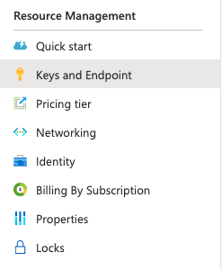

# Integrating Alexa with Microsoft LUIS

Alexa has a very good Natural Language Processing engine, However, there another NLP in the market that can be used and those are including more and more capabilities.

<!-- TOC -->

- [Integrating Alexa with Microsoft LUIS](#integrating-alexa-with-microsoft-luis)
  - [Prerequisites](#prerequisites)
  - [Preface](#preface)
  - [Setting up our Alexa Skill](#setting-up-our-alexa-skill)
  - [Creating Azure Cognitive Services](#creating-azure-cognitive-services)
  - [Creating MS LUIS App](#creating-ms-luis-app)
  - [Calling MS LUIS from Alexa Skill](#calling-ms-luis-from-alexa-skill)
  - [Final Result](#final-result)
  - [Resources](#resources)
  - [Conclusion](#conclusion)

<!-- /TOC -->

## Prerequisites

Here you have the technologies used in this project
1. Node.js v12.x
2. Visual Studio Code
3. Azure Account

## Preface

Alexa's NLP covers 99% of the most common user's use cases and we can create powerful Alexa Skills using its engine. However, it is a fact that MS LUIS, as NLP engine, has evolved a lot and there we can find lot of functionalities that we cannot find within Alexa such its [Prebuilt Domains](https://docs.microsoft.com/en-us/azure/cognitive-services/luis/howto-add-prebuilt-models) or its prebuilt entities, subentities and [Regular expression entities](https://docs.microsoft.com/en-us/azure/cognitive-services/luis/luis-how-to-add-entities).


## Setting up our Alexa Skill

The first thing we need to do is set up our **interaction model**. For that we are going to create the `OrderIntent`. This intent will have, for this example, just one utterance and one slot. This slot will have the `AMAZON.SearchQuery` type:


By definition, a `AMAZON.SearchQuery` slot is a type of slot a little different from the rest, with this slot we will be able to recognize less-predictable input that makes up the search query. It is basically a search query like you might enter into a standard search engine. To use this Slot you have to add a carrier phrase on your utterances. In this case I used `I want`. So basically we are going to send to MS LUIS everything that Alexa recognizes after we said `I want...`.

## Creating Azure Cognitive Services

To interact with a Microsoft LUIS App from an Amazon Alexa Skill we need to create some Azure resources.

For that, we need to create is a Natural Language Understanding Service down Cognitive Services on the [Azure Portal](https://portal.azure.com/):


**NOTE:** make sure that you have checked the **prediction** and **authoring** services during the creation process.

After this, make sure that you copy the endpoint. We are going to use this endpoint to interact with MS LUIS. You can find the endpoint after the creation on the **Keys and Endpoint** section:



Also make sure you have copied the `region` and the `Key 1` (this is the subscription id we are going to use in next steps)!

## Creating MS LUIS App

Once you have created your Azure resources, you have to create your MS Luis App on the [Luis Portal](https://www.luis.ai/):


**NOTE:** make sure that you use the prediction endpoint you have created in the previous step.

Now we have our MS LUIS app, let's add the interaction model here:


When you have built your Entities and Intents, you have to train your Model and publish your LUIS app to `Staging`.

## Calling MS LUIS from Alexa Skill

Now that we have everything set up, let's write our code! To interact with MS LUIS from the Alexa Skill Lambda written Node.JS we are going to use the npm package called `@azure/cognitiveservices-luis-runtime`. You can find the full documentation of the package [here](https://www.npmjs.com/package/@azure/cognitiveservices-luis-runtime).

First, we have to create our `OrderIntentHandler` which is the handler that is going to manage all the requests from the `OrderIntent`:

```javascript

const OrderIntentHandler = {
    canHandle(handlerInput) {
        return Alexa.getRequestType(handlerInput.requestEnvelope) === 'IntentRequest'
            && Alexa.getIntentName(handlerInput.requestEnvelope) === 'OrderIntent';
    },
    async handle(handlerInput) {
        predictionRequest.query = Alexa.getSlotValueV2(handlerInput.requestEnvelope, 'luisquery').value;

        var result = await client.prediction.getSlotPrediction(appId, 
                                                                'Staging', 
                                                                predictionRequest, 
                                                                { verbose: true, showAllIntents: true });
        var speak = intentDispatcher(result.prediction.topIntent, result.prediction.entities)
        return handlerInput.responseBuilder
            .speak(speak)
            .reprompt(speak)
            .getResponse();
    }
};

```

As you can see in the code above, we are getting the value from our `AMAZON.SearchQuery` slot called `luisquery` and then, we are sending that value to MS LUIS using the `client` and the function `getSlotPrediction`.

To build the client we need three properties:
1. MS LUIS app id: You can find this value in you LUIS APP on the LUIS Portal.
2. MS Subscription id. This MS Subscription id is the one that we have get on the previous step.
3. MS LUIS Prediction endpoint. This endpoint is the one that we have get on the previous step.

When we have these properties we can create our MS LUIS Client like this:
```javascript

require('dotenv').config({path: '.env'})
const { CognitiveServicesCredentials } = require("@azure/ms-rest-azure-js");
const { LUISRuntimeClient } = require("@azure/cognitiveservices-luis-runtime");
 
let subscriptionKey = process.env["subscription-key"];
const creds = new CognitiveServicesCredentials(subscriptionKey);
 
const client = new LUISRuntimeClient(creds, process.env["endpoint"]);
const appId = process.env["app-id"]; // replace this with your appId.
const predictionRequest = {
    query: "",
    options: {
      datetimeReference: new Date(),
      preferExternalEntities: true
    }
  };
```

The result that we are going to receive from MS LUIS will be managed by the `intentDispatcher`:

```javascript

function intentDispatcher(intent, entities) {
    var result = '';
    switch (intent) {
        case 'PizzaIntent':
            result = `Okay, I will give you ${entities['number']} Pizzas`
            break;
        case 'BurgerIntent':
            result = `Okay, I will give you ${entities['number']} Burgers`
            break;
    
        default:
            result = 'Sorry I  didn\'t catch you'
            break;
    }

    return result;

}

```

## Final Result

And that's it, here you have the full code running. Alexa using LUIS as its NLP engine:


## Resources
* [Official Alexa Skills Kit Node.js SDK](https://www.npmjs.com/package/ask-sdk) - The Official Node.js SDK Documentation
* [Official Alexa Skills Kit Documentation](https://developer.amazon.com/docs/ask-overviews/build-skills-with-the-alexa-skills-kit.html) - Official Alexa Skills Kit Documentation
* [Official Express Adapter Documentation](https://developer.amazon.com/en-US/docs/alexa/alexa-skills-kit-sdk-for-nodejs/host-web-service.html) - Express Adapter Documentation
* [Official Microsoft Azure SDK Documentation](https://github.com/Azure/azure-sdk-for-js) - DOfficial Microsoft Azure SDK Documentation

## Conclusion 

AS you can see we can integrate in an easy way other NLPs engines within our Alexa Skills. This example is just an experiment and a simple showcase but I recommend you to use only the Alexa built-in NLP since you can get unexpected recognized input  using `AMAZON.SearchQuery`.

I hope this example project is useful to you.

That's all folks!

Happy coding!


